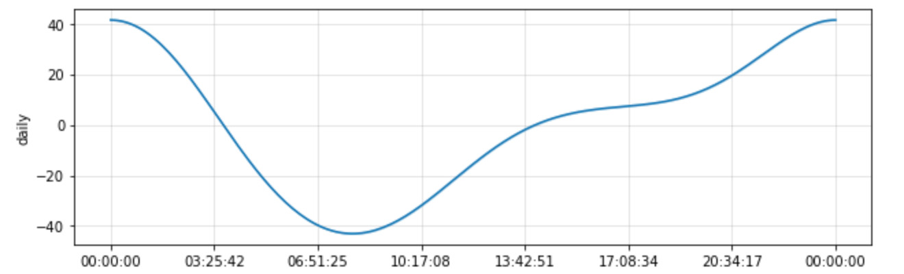
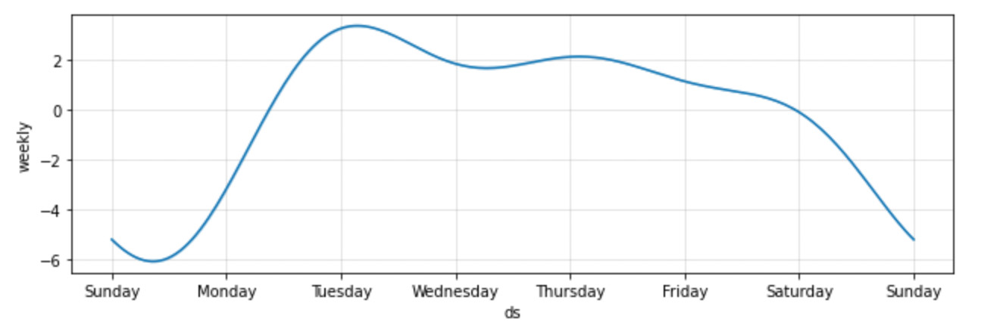
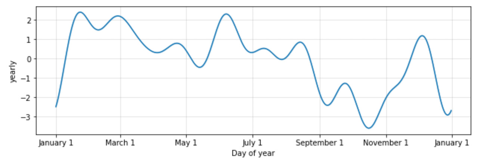

# forecasting_net_prophet

This Jupyter Notebook uses data from Mercado Libra to analyze patterns in Google search traffic. Then mines that data for seasonality. Relates the search traffic to stock price patterns and uses Prophet to create a time series and forecast future revenue.

The data is provided in a CSV file in the Resources folder 

The charts below show the daily/weekly/day of year forecasts<br>

<br>

<br>




## Technologies

This notebook requires:


<br>This notebook requires Jupyter lab
<br>Installation:
```
pip install jupyterlab
````

This applications uses pandas<br>


```
pip install pandas
```

<br>
This application uses Prophet
<br>

```
pip install prophet
```


## Contributors

Brought to you by Rachel Bates

---

## License

Creative Commons